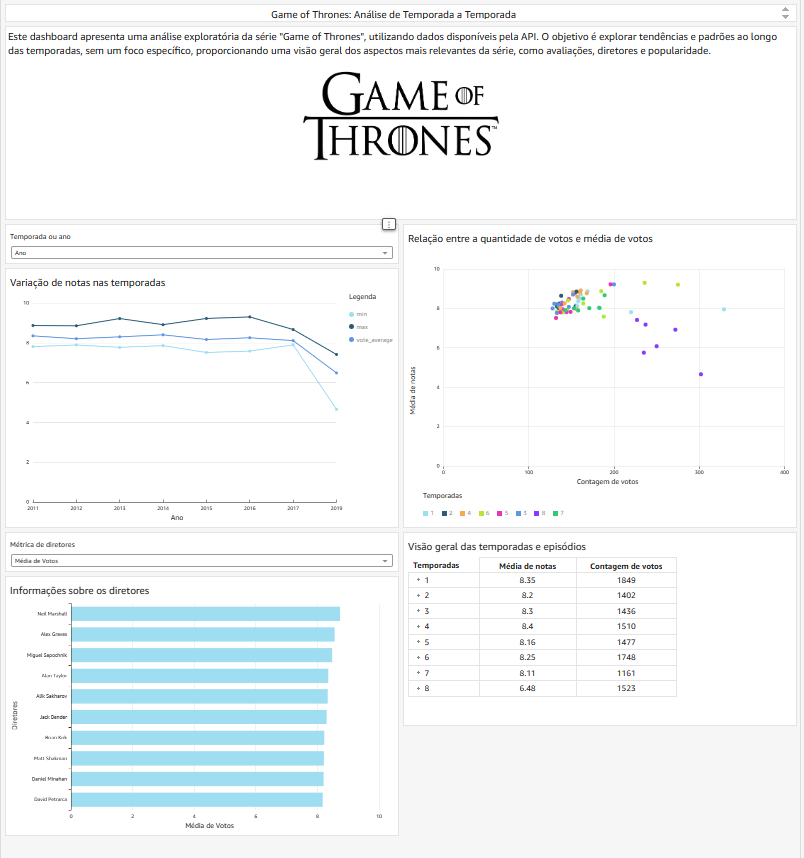
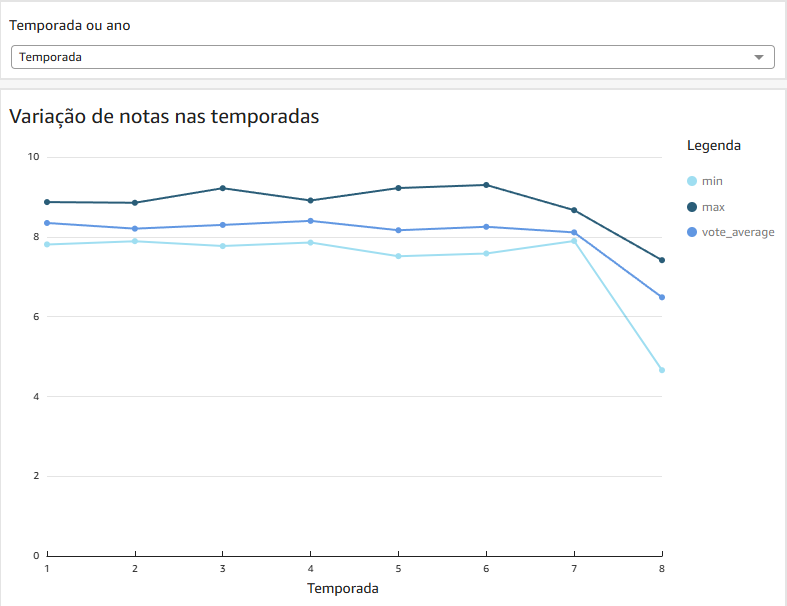
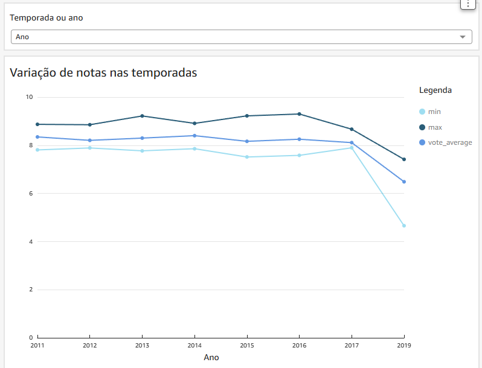
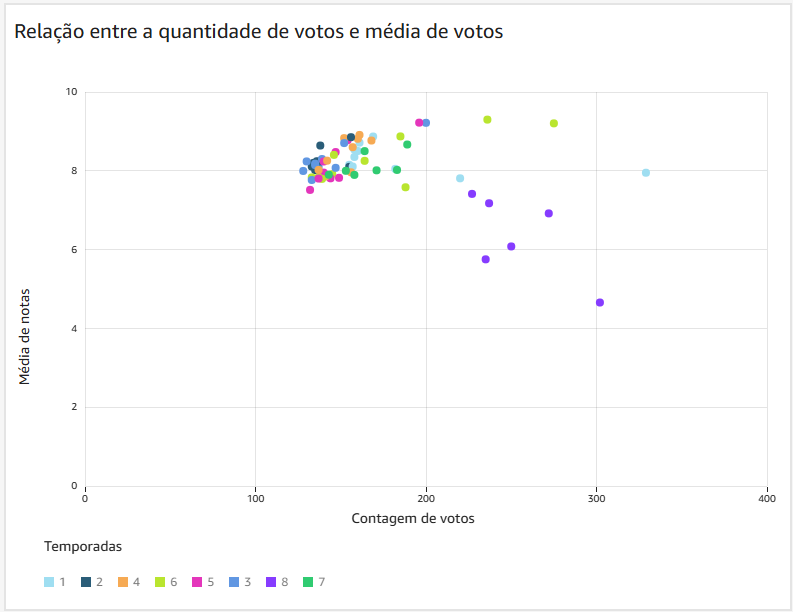
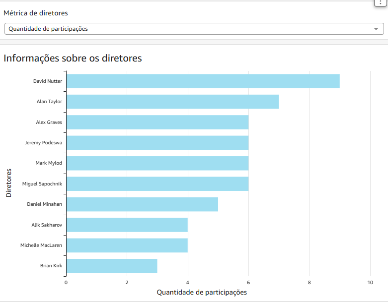
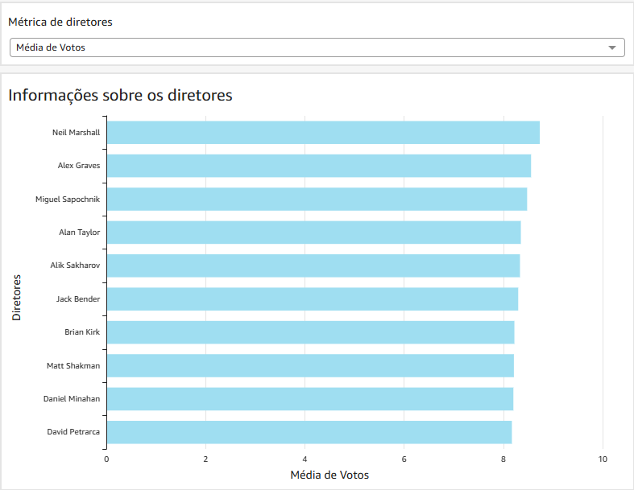
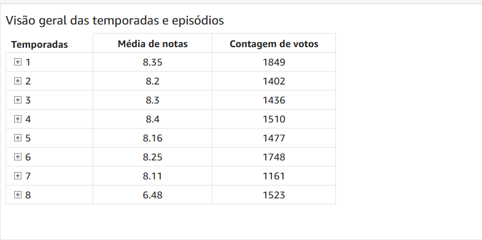

# 📊 Análise de Game of Thrones

## 🎯 Objetivo

O objetivo desta análise é realizar um estudo detalhado dos dados relacionados aos episódios e temporadas da série **Game of Thrones**, fornecendo uma base sólida para a criação de insights valiosos e visualizações impactantes.

---

## 🔍 Análise

1. Mostrar a média das notas (`vote_average`) por temporada ou ano de lançamento, incluindo valores mínimo (`min`) e máximo (`max`).  
2. Analisar a relação entre o número de votos (`vote_count`) e as notas (`vote_average`).  
3. Quantidade de episódios dirigidos por cada diretor na série, também por temporada.  
4. Nota média dos episódios dirigidos por cada diretor, também por temporada.  
5. Tabela com os principais dados (média de notas e contagem de votos) dos episódios e temporadas.

---

## ⚙️ Passos Executados

- Criação de uma **view consolidada** com todos os dados em uma tabela só, facilitando a importação no QuickSight.  
- Seleção das informações que seriam exibidas no dashboard.  
- Montagem do **dashboard interativo**.

---

## 💻 Código para criar a view

```sql
CREATE OR REPLACE VIEW got_full_view AS
SELECT
    CONCAT(CAST(fe.season_id AS VARCHAR), 'x', CAST(fe.episode_number AS VARCHAR)) AS episode_id,
    fe.id,
    fe.season_id,
    fe.episode_number,
    fe.vote_average,
    fe.vote_count,
    fe.processing_date,
    ds.total_vote_count AS season_total_vote_count,
    de.title,
    de.air_date,
    dc.actor_id,
    dc.actor,
    dc.character,
    dd.director_id,
    dd.director_name
FROM
    fact_episodes fe
LEFT JOIN
    dim_seasons ds ON fe.season_id = ds.season_id
LEFT JOIN
    dim_episodes de ON fe.season_id = de.season_id AND fe.episode_number = de.episode_number
LEFT JOIN
    dim_cast dc ON fe.season_id = dc.season AND fe.episode_number = dc.episode_number
LEFT JOIN
    dim_directors dd ON fe.directors = dd.director_name
LEFT JOIN
    dim_dates ddt ON fe.air_date = ddt.date;
```

## 📈 Explicando o Dashboard:

## 🖥 Dashboard Completo



## 📉 Variação de notas nas temporadas:




Nesta parte do dashboard, eu analiso como as avaliações dos episódios (representadas pela média, mínima e máxima das notas) variaram ao longo das temporadas. Como é possível observar, há um declínio acentuado a partir da sétima. Esse gráfico de linha nos ajuda a visualizar essa mudança de forma clara e direta, destacando a variação temporadas.
A partir desse gráfico é possível filtrar o dashboard todo por temporada, clicando na temporada desejada no gráfico.

## 🔄 Relação entre a quantidade de votos e a média de votos:



Este gráfico de dispersão mapeia a relação entre a contagem de votos e a média das notas dos episódios. Cada ponto representa um episódio, colorido de acordo com a temporada a que pertence. Com esse gráfico é possível perceber que mesmo a 8° temporada tendo decaído em avaliações, ela se destaca em número de votos. Esse gráfico nos ajuda a identificar padrões de avaliação e popularidade em um nível mais granular.

## 🎬 Informações sobre os diretores:




Aqui, trago uma visão focada nos diretores da série. Este gráfico de barras classifica os diretores de acordo com a média das notas dos episódios que eles dirigiram. Além disso, também é possível analisar a quantidade de episódios dirigidos por cada diretor, o que oferece um panorama sobre o impacto da contribuição de cada um na série. Dessa forma, é possível identificar quais diretores não só foram mais bem recebidos pelo público, mas também qual a sua participação em termos de quantidade de episódios dirigidos.

## 📋 Visão geral das temporadas e episódios:



Essa tabela é crucial para o dashboard, pois permite que o usuário acesse informações mais detalhadas. Quando clicamos no número da temporada, conseguimos visualizar os dados específicos de cada episódio. Isso torna a análise muito mais precisa e personalizada. Além de resumir as temporadas com a média de notas e a contagem de votos, a tabela facilita a exploração detalhada dos dados, permitindo uma compreensão mais profunda de como cada episódio se desempenhou dentro de sua respectiva temporada.

## ❗ Possível resposta para queda de avaliações da série

A queda de avaliações na série de Game of Thrones pode ter sido ocasionada devido a qualidade do roteiro, visto que a série é baseada em uma coleção de livros, As 5 primeiras temporadas seguiram adaptando o conteúdo do livro, porém a série ultrapassou o conteúdo dos livros e seguiu um caminho diferente da visão do autor George RR Martin.
Eu tirei essas conclusões baseado no conteúdo de uma notícia do Tecmundo "Game of Thrones: George RR Martin diz que série se perdeu após 5ª temporada"

Esse trecho da notícia reforça meu ponto:

De acordo com o que foi exposto no livro Tinderbox: HBO’s Ruthless Pursuit of New Frontiers, escrito por James Andrew Miller, George RR Martin, autor da coleção de livros que deu origem à série Game of Thrones, teria criticado o desenvolvimento que a produção,  encabeçada pela dupla David Benioff e DB Weiss, teve ao longo dos seus últimos anos.
Segundo ele, após a conclusão da 5ª temporada, as coisas passaram a tomar rumos muito diferentes do que havia sido planejado anteriormente. As informações foram colhidas por meio do depoimento de Paul Haas, agente do escritor, autorizado pessoalmente por Martin a falar sobre o assunto.

