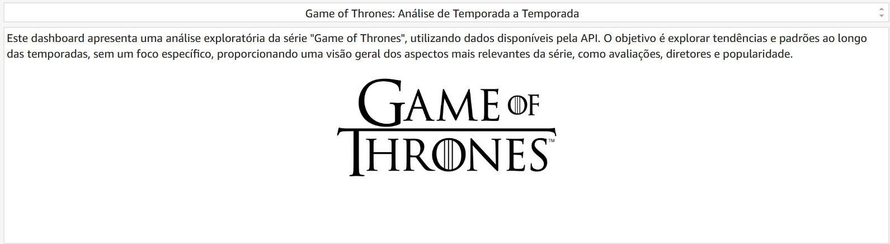

# Evidências

## Dashboard Completo:

## Ínicio do Dashboard:

## Gráfico com as notas das temporadas:

## Gráfico com as notas por tempo:

## Gráfico com a relação entre a contagem de votos e média de notas:

## Gráfico com dados sobre a quantidade de episódios por diretores:

## Gráfico com dados sobre as notas médias dos diretores:

## Tabela com dados principais dos episódios:

