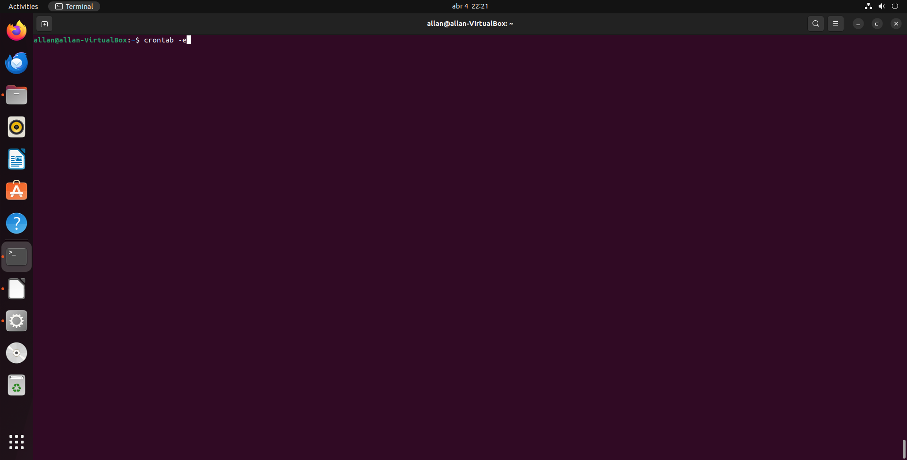
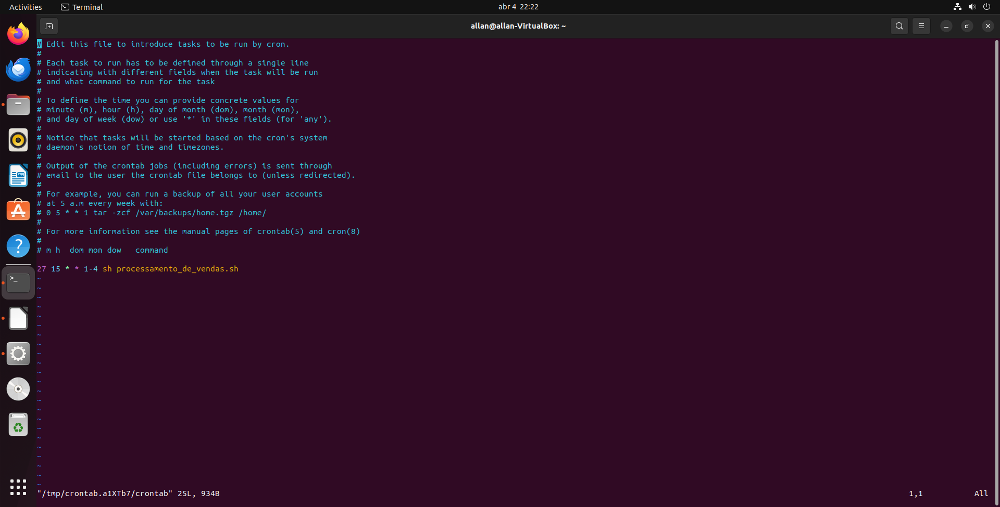
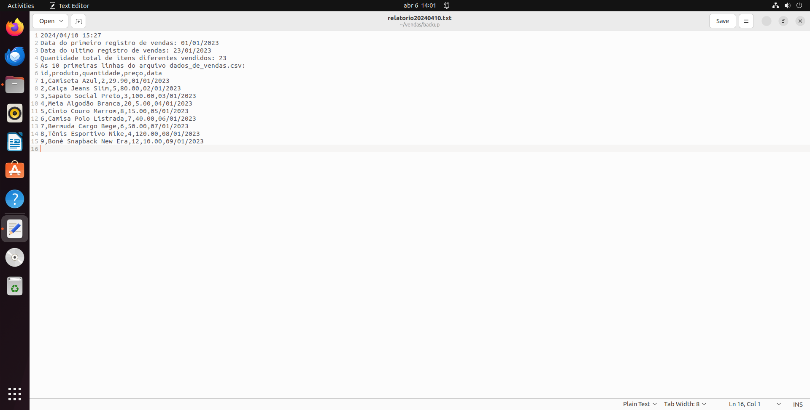
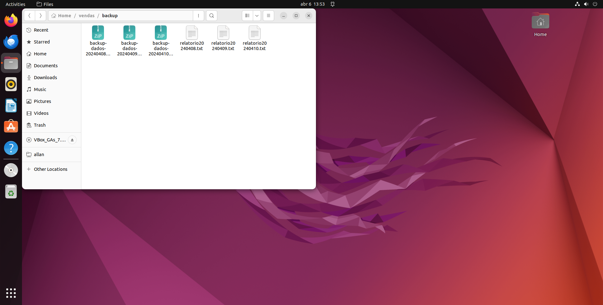
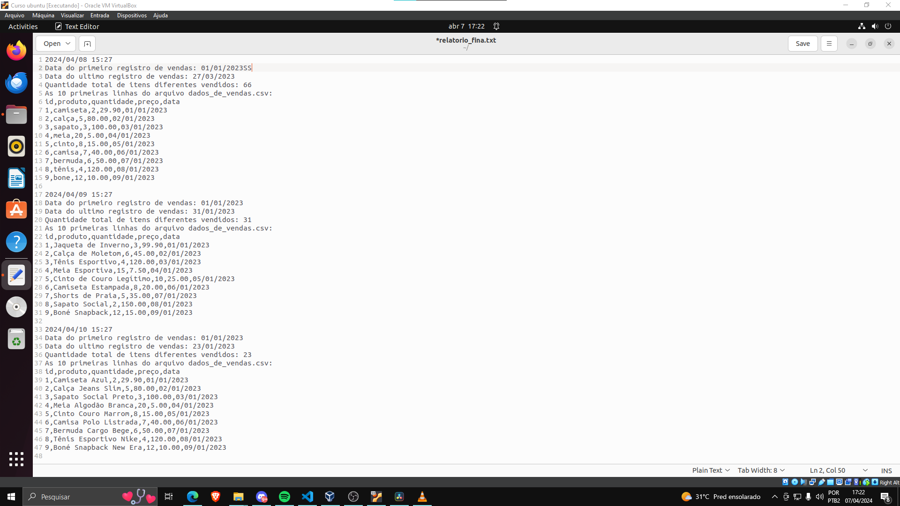

# Exercícios

4.1 Criar arquivo executável
[Resposta Ex 4.1](exercicios/processamento_de_vendas.sh)

4.2 Agendar a execução do processamento
[Resposta Ex 4.2](exercicios/ex4.2.txt)

4.3 Arquivo pra criar o relátorio final
[Resposta Ex 4.3](exercicios/consolidador_de_processamento_de_vendas.sh)

# Evidências

A seguir estão algumas imagens pra comprovar as atividades e resultados do código:

