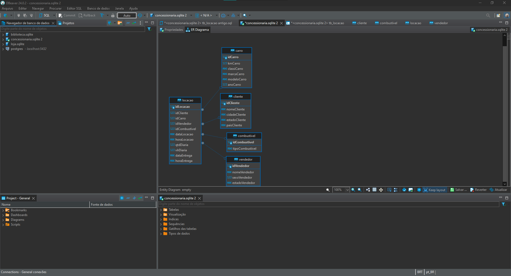
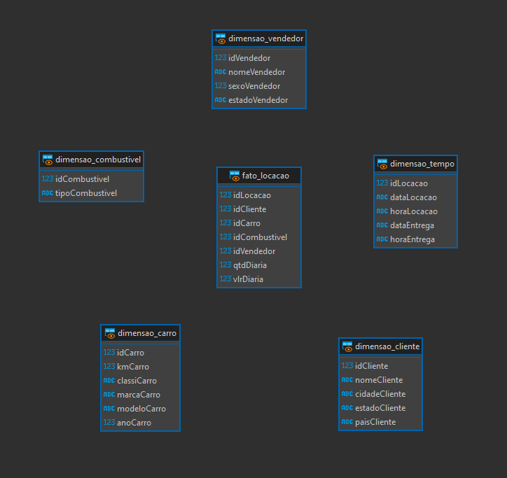
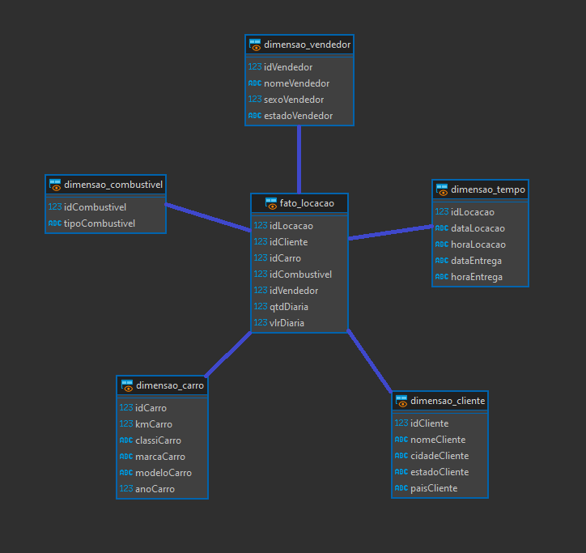

# Exercícios

Exercícios I
[Exercícios I](exercicios/Exercícios_1)

Exercícios II
[Exercícios II](exercicios/Exercícios_2)

# Evidências

Modelo Relacional normalizado:

Modelo dimensional pelo view:   

Modelo dimensional pelo view (ilustração):

