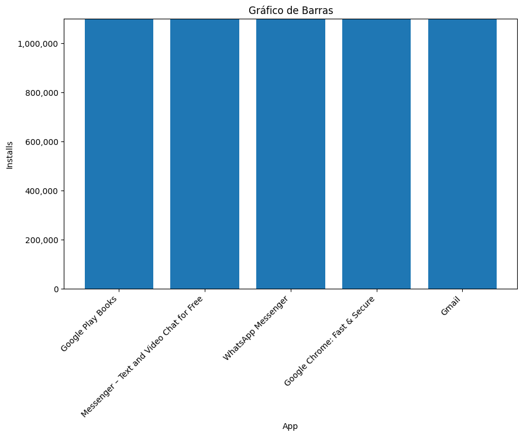
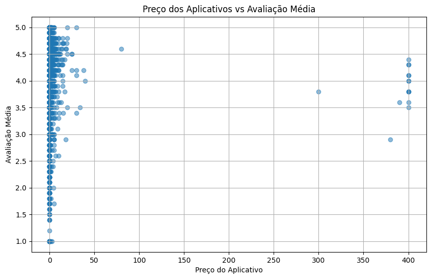
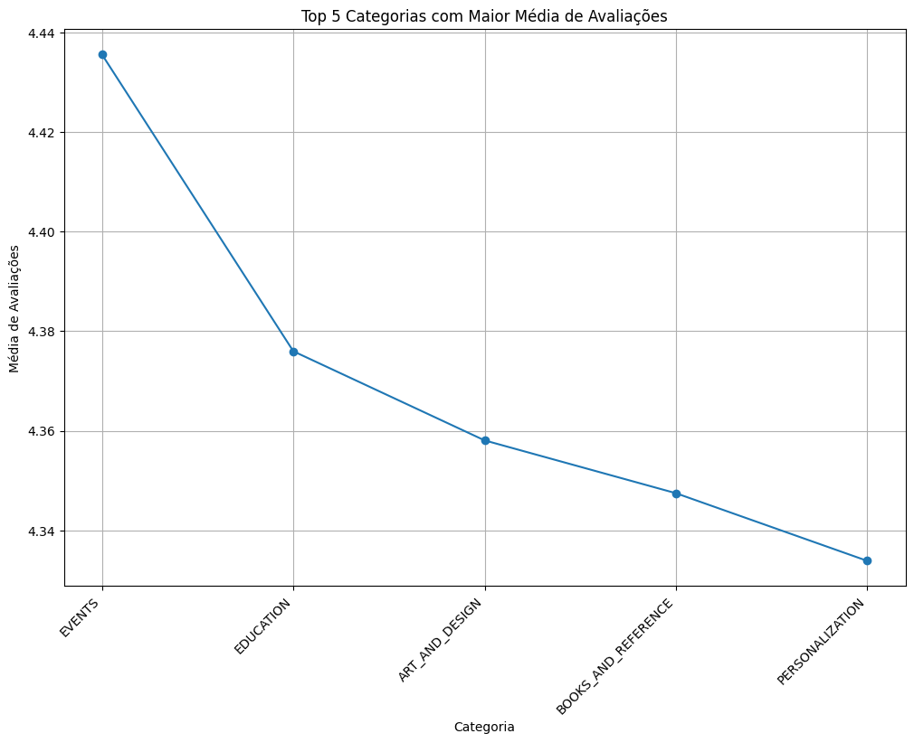
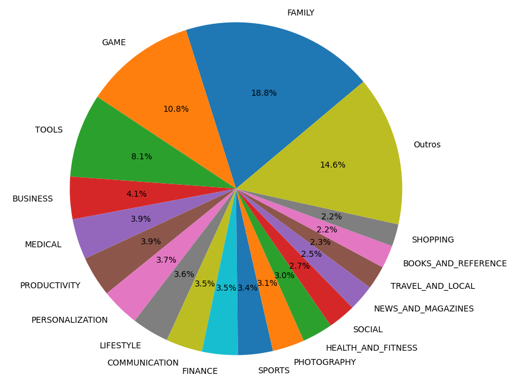

# Exercícios

Exercícios I
[Exercícios I](exercicios/Exercícios_1)

Exercícios II
[Exercícios II](exercicios/Exercícios_2)

# Evidências

Gráfico de barras:

Gráfico de dispersão:   

Gráfico de linha:

Gráfico de pizza:

