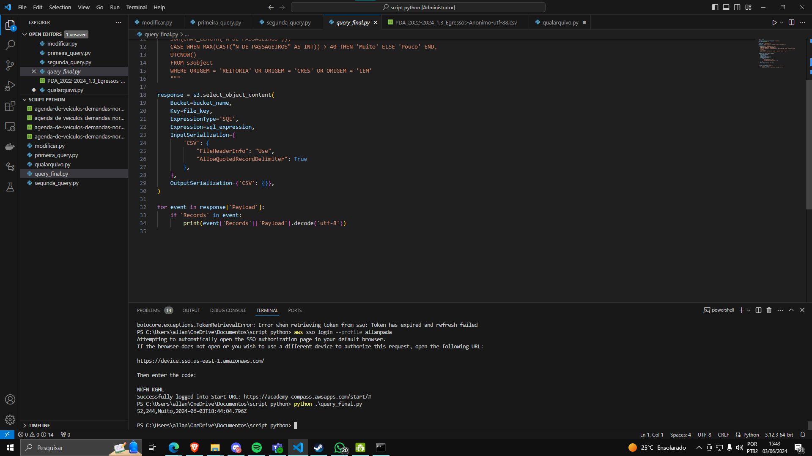
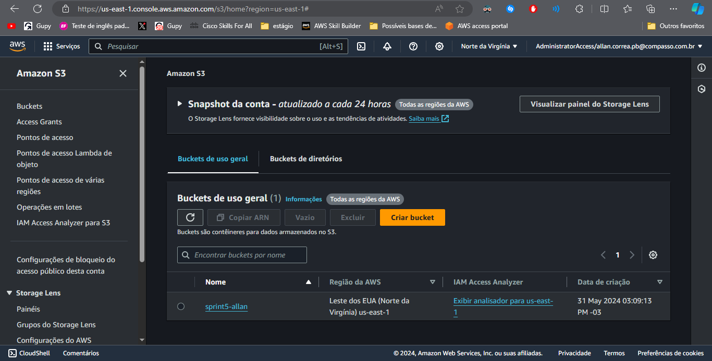

# Evidências

Evidência do código funcionando:

# Passos executados

* Criei um bucket pelo site da aws
* Converti minha base de dados para utf-8 pelo Google sheets
* Configurei meu sso e loguei

O código escrito foi esse:

import boto3

### Iniciar uma sessão com um perfil específico
session = boto3.Session(profile_name='allanpada')
### Criar um cliente para interagir com o Amazon S3 usando a sessão
s3 = session.client('s3')

### Definir o bucket e o arquivo
bucket_name = 'sprint5-allan'
file_key = 'agenda-de-veiculos-demandas-normais-e-de-campov4.csv'

### Definir a consulta SQL com as funções
sql_expression = """SELECT
    MAX(CAST("N DE PASSAGEIROS" AS INT)),
    SUM(CHAR_LENGTH("N DE PASSAGEIROS")),
    CASE WHEN MAX(CAST("N DE PASSAGEIROS" AS INT)) > 40 THEN 'Muito' ELSE 'Pouco' END,
    UTCNOW()
    FROM s3object
    WHERE ORIGEM = 'REITORIA' OR ORIGEM = 'CRES' OR ORIGEM = 'LEM'
    """

### Configurar o pedido para S3 Select
response = s3.select_object_content(
    Bucket=bucket_name,
    Key=file_key,
    ExpressionType='SQL',
    Expression=sql_expression,
    InputSerialization={
        'CSV': {
            "FileHeaderInfo": "Use",
            "FieldDelimiter": ',',
            "AllowQuotedRecordDelimiter": True
        },
    },
    OutputSerialization={'CSV': {}},
)

### Extrair e imprimir os resultados
for event in response['Payload']:
    if 'Records' in event:
        print(event['Records']['Payload'].decode('utf-8'))
