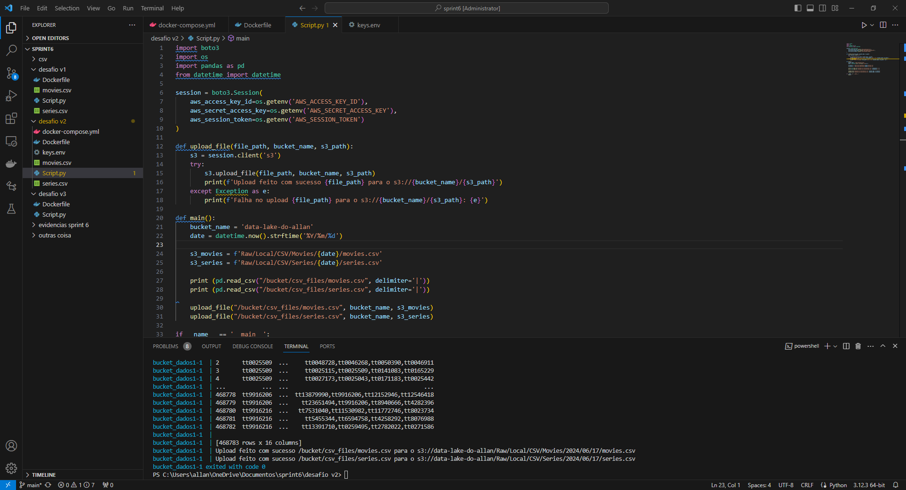
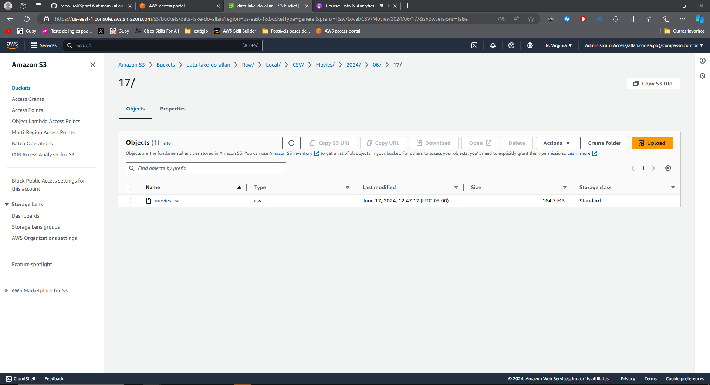

# Exercicios

[Exercicio do Lab AWS S3](exercicios/lab_S3)

[Exercicio do Lab AWS Athena](exercicios/lab_athena)

[Exercicio do lab AWS Lambda](exercicios/lab_lambda)

# Evidências

## Código funcionando:

## S3 após a execução do código:

# Passos executados

* Criei um bucket pelo site da aws
* Escrevi os códigos do python e docker

## Observação

Os arquivos csv dentro do git são só para ilustração, não é possível colocar os arquivos reais por limitações do GitHub

## Código Python

### Importa as bibliotecas
    import boto3
    import os
    import pandas as pd
    from datetime import datetime 

### Cria uma sessão boto3 com as credenciais da AWS obtidas das variáveis de ambiente
    session = boto3.Session(
        aws_access_key_id=os.getenv('AWS_ACCESS_KEY_ID'),
        aws_secret_access_key=os.getenv('AWS_SECRET_ACCESS_KEY'),
        aws_session_token=os.getenv('AWS_SESSION_TOKEN')
    )
### Função para fazer upload de um arquivo para o S3
    def upload_file(file_path, bucket_name, s3_path):
        s3 = session.client('s3')
        try:
            s3.upload_file(file_path, bucket_name, s3_path)
            print(f'Upload feito com sucesso {file_path} para o s3://{bucket_name}/{s3_path}')
        except Exception as e:
            print(f'Falha no upload {file_path} para o s3://{bucket_name}/{s3_path}: {e}')

### Função principal
    def main():
        bucket_name = 'data-lake-do-allan'
        date = datetime.now().strftime('%Y/%m/%d')

### Caminhos no S3 para os arquivos
    s3_movies = f'Raw/Local/CSV/Movies/{date}/movies.csv'
    s3_series = f'Raw/Local/CSV/Series/{date}/series.csv'

### Lê e imprime os arquivos CSV locais
    print(pd.read_csv("/bucket/csv_files/movies.csv", delimiter='|'))
    print(pd.read_csv("/bucket/csv_files/series.csv", delimiter='|'))

### Faz o upload dos arquivos para os caminhos definidos no S3
    upload_file("/bucket/csv_files/movies.csv", bucket_name, s3_movies)
    upload_file("/bucket/csv_files/series.csv", bucket_name, s3_series)

### Executa a função principal se este script for executado diretamente
    if __name__ == '__main__':
        main()

## Código Dockerfile

### Usa a imagem oficial do Python 3.9 como base 
    FROM python:3.9  

### Define o diretório de trabalho dentro do contêiner como /bucket
    WORKDIR /bucket  

### Instala as bibliotecas boto3 e pandas
    RUN pip install boto3 pandas

### Cria um diretório chamado csv_files dentro do contêiner
    RUN mkdir csv_files  

### Copia os arquivos CSV do diretório local para o diretório /bucket/csv_files no contêiner
    COPY movies.csv /bucket/csv_files/movies.csv
    COPY series.csv /bucket/csv_files/series.csv

### Copia o script Python para o diretório /bucket no contêiner
    COPY Script.py /bucket/Script.py

### Define o comando que será executado quando o contêiner iniciar
    CMD ["python", "Script.py"]

## Código docker-compose

### Define um serviço chamado bucket_dados1
    services:
        bucket_dados1:
### Especifica a imagem a ser utilizada pelo serviço (será construída a partir do Dockerfile)
    image: bucket_dados1
### Constrói a imagem a partir do Dockerfile no diretório atual
    build: .
### Especifica um arquivo de variáveis de ambiente que será carregado
    env_file:
      - keys.env
### Mapeia o arquivo local movies.csv para o contêiner
    volumes:
      - ./movies.csv:/bucket/csv_files/movies.csv
### Mapeia o arquivo local series.csv para o contêiner
      - ./series.csv:/bucket/csv_files/series.csv
### Define o comando a ser executado no contêiner
    command: ["python", "Script.py"]
