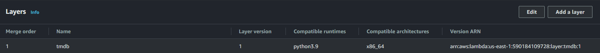
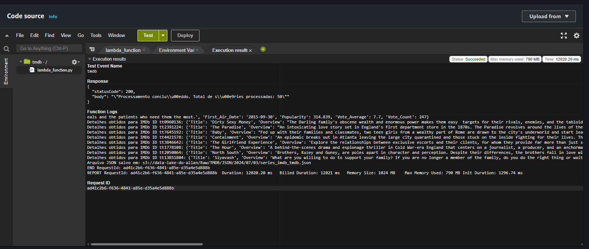
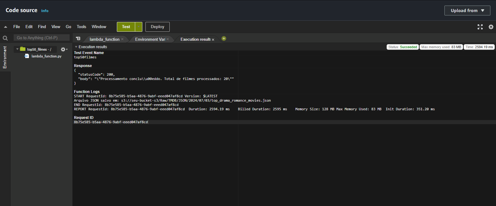
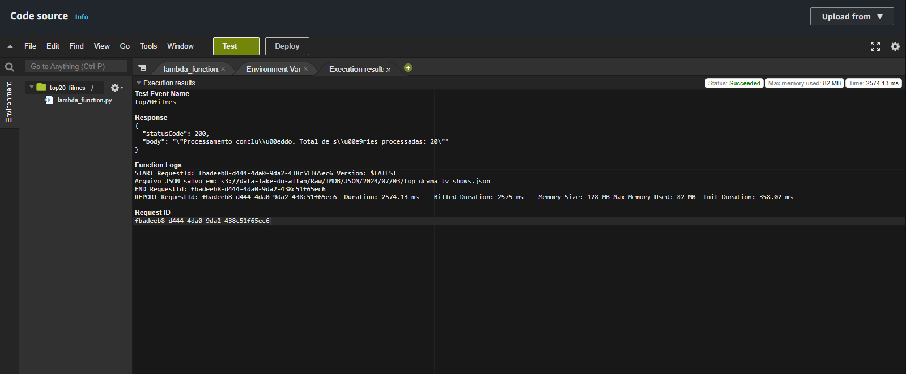
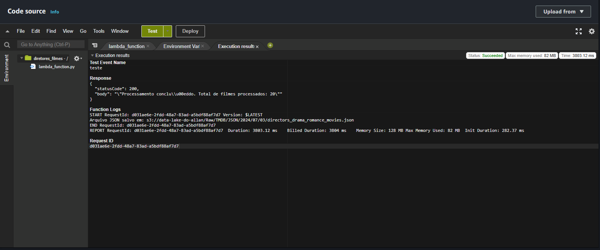
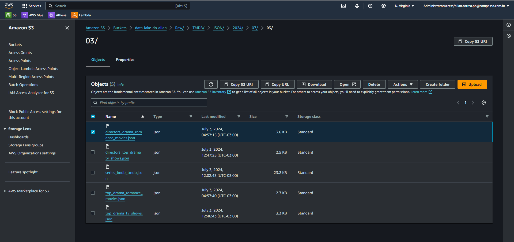

# Exercicios

[Exercicio de spark](exercicios/exercicio_spark.txt)

[Exercicio do Lab AWS Glue](exercicios/lab_glue)

# Evidências

## Layer criada:

## Resultado do código que inclui os ids em comum:

## Resultado do código que traz os top20 filmes do tmdb:

## Resultado do código que traz os top20 séries do tmdb:

## Resultado do código que traz os diretores dos top20 filmes do tmdb:

## S3 após a execução do código:
