# Exercicios

## Exercicio de Geração e massa de dados

[Etapa 1](exercicios/Exercícios_Geração_e_massa_de_dados/Etapa1.py)

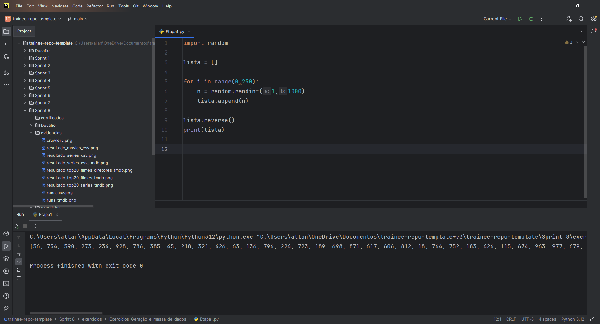

[Etapa 2](exercicios/Exercícios_Geração_e_massa_de_dados/Etapa2.py)

[Arquivo animals.csv gerado](exercicios/Exercícios_Geração_e_massa_de_dados/animals.csv)

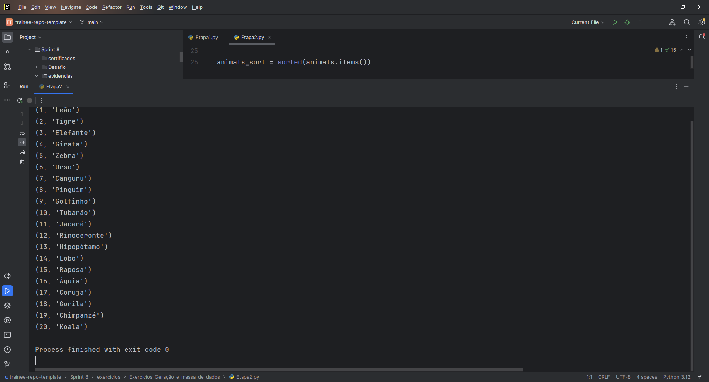

[Etapa 3](exercicios/Exercícios_Geração_e_massa_de_dados/Etapa3.py)

O arquivo que é gerado aqui é grande demais para ser colocado no github

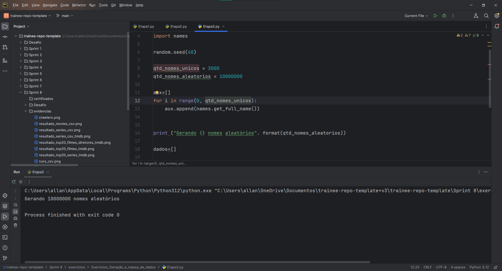

## Exercicio de spark

Os 2 arquivos estão divididos entre consulta com o spark na parte 1 e spark.sql na parte 2

[Exercicio de spark Parte 1](exercicios/Exercícios_Apache_Spark/parte1.py)

Evidência da Parte 1

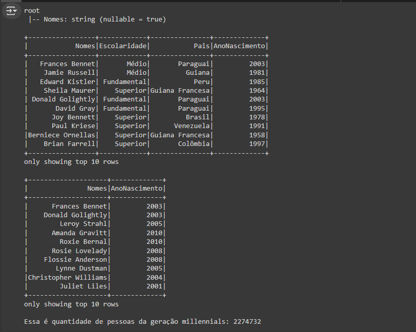

[Exercicio de spark Parte 2](exercicios/Exercícios_Apache_Spark/parte2.py)

Evidência da Parte 2

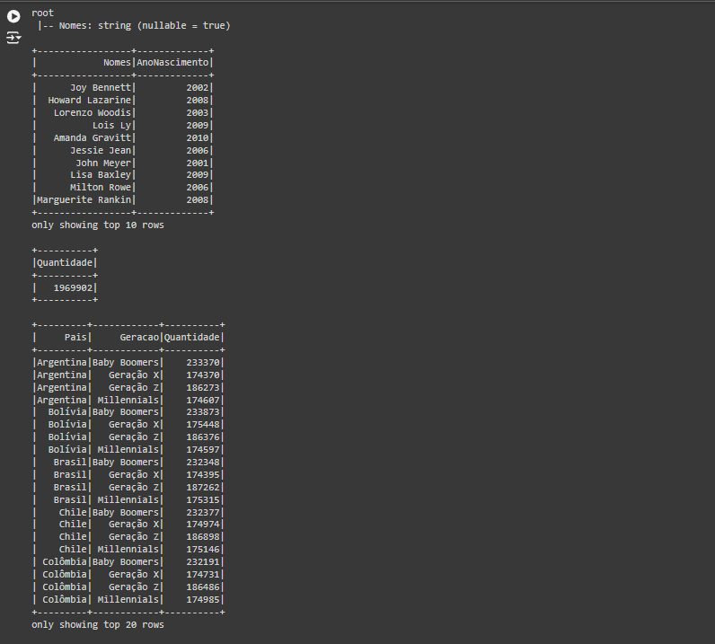

# Evidências

## Runs do CSV:
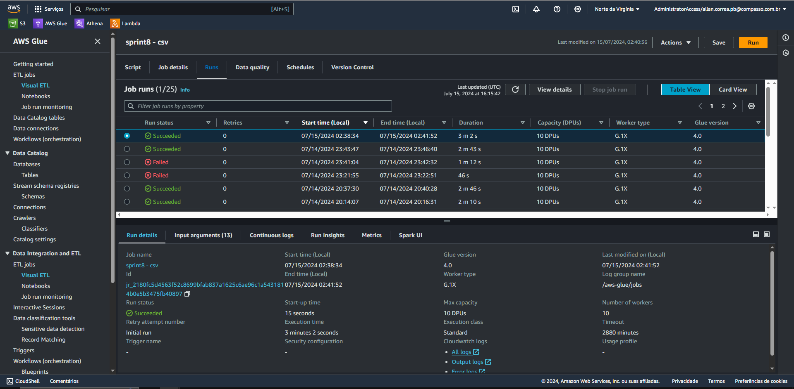

## Runs do TMDB:

## Resultado no AWS Athena dos dados de filmes do CSV:
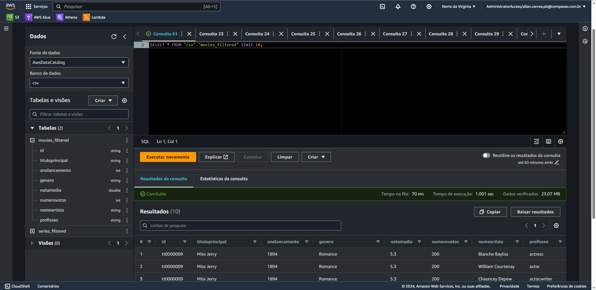

## Resultado no AWS Athena dos dados de séries do CSV:
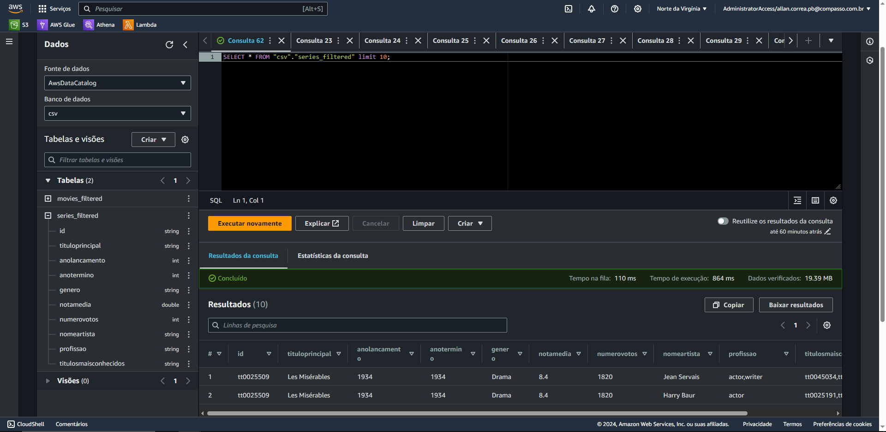

## Resultado no AWS Athena dos dados de top50 séries do CSV e TMDB em que os ids coincidiram:

## Resultado no AWS Athena dos dados dos diretores dos top 20 séries do TMDB:
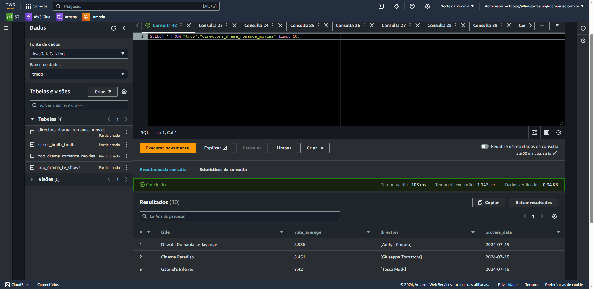

## Resultado no AWS Athena dos dados dos top 20 filmes do TMDB:
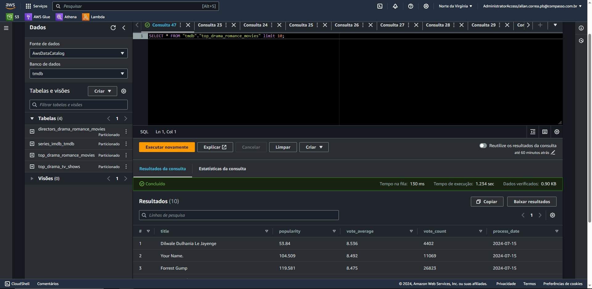

## Resultado no AWS Athena dos dados dos top 20 séries do TMDB:
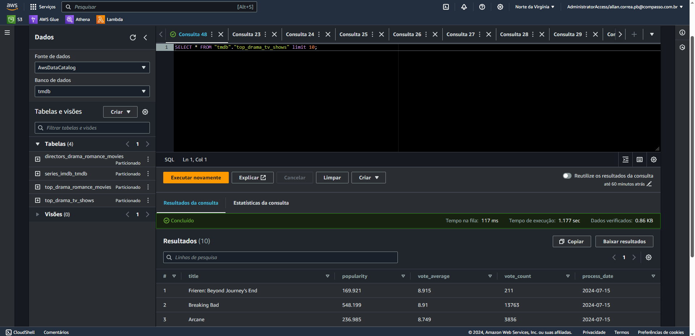
