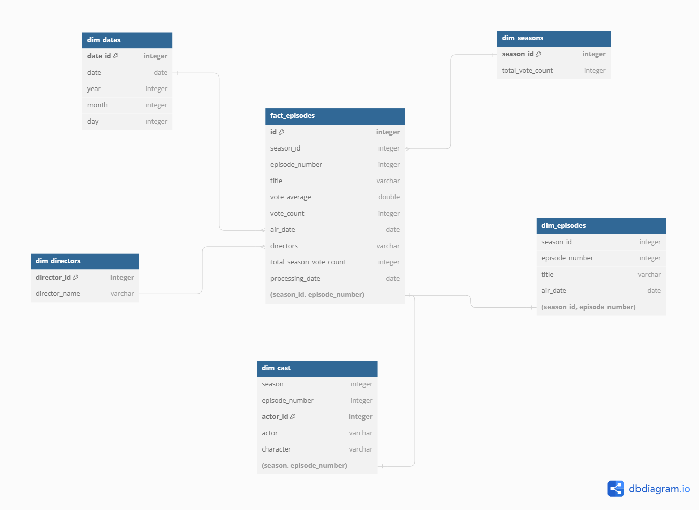

# Desafio

O objetivo do meu desafio teve uma grande mudança, eu tinha o objetivo de analisar de maneira geral as séries e filmes, porém ao chegar na sprint 9 e ter que criar o modelo multidimensional, percebi que a maneira que meus dados estavam estruturados não eram adequados, então no proximo tópico explico o novo objetivo

Como fiz essa mudança vou deixar uma pasta extra caso seja necessário, com os códigos referentes ao que eu teria feito nas sprints passadas, caso eu tivesse definido o tema antes.

[Código do lambda sprint 7](extra/lambda_sprint7.py)

[Código do Glue sprint 8](extra/job_glue_trusted_sprint8.py)

## Objetivo

O objetivo da minha análise é realizar um estudo detalhado dos dados relacionados aos episódios e temporadas da série "Game of Thrones", fornecendo uma base sólida para a criação de insights valiosos e visualizações impactantes.

## Perguntas

Essas perguntas podem passar por uma seleção quando chegar o momento de serem usadas no QuickSight.

### Análise de Episódios e Temporadas

1. Qual é o episódio mais popular em termos de média de votos?

    Visualização: Gráfico de barras mostrando episódios e suas médias de votos.

2. Como a popularidade dos episódios varia ao longo das temporadas?

    Visualização: Gráfico de linhas ou área com a popularidade dos episódios ao longo das temporadas.

3. Qual é a temporada com o maior número total de votos?

    Visualização: Gráfico de barras mostrando o total de votos por temporada.

### Análise de Diretores

1. Qual diretor tem a média de votos mais alta nos episódios que dirigiu?

    Visualização: Gráfico de barras mostrando a média de votos por diretor.

2. Qual é o diretor que mais dirigiu episódios?

    Visualização: Gráfico de barras mostrando a contagem de episódios por diretor.

### Análise de Atores

1. Qual ator apareceu em mais episódios?

    Visualização: Gráfico de barras mostrando o número de episódios por ator.

2. Qual é a média de avaliação dos episódios em que um ator específico apareceu?

    Visualização: Gráfico de barras mostrando a média de votos por ator.

### Análise Temporal

1. Como a média de votos dos episódios varia ao longo dos anos?

    Visualização: Gráfico de linhas mostrando a média de votos por ano.

2. Qual mês teve a maior quantidade de lançamentos de episódios?

    Visualização: Gráfico de barras ou linhas mostrando o número de lançamentos por mês.

### Análise de Relacionamentos

1. Quais diretores e atores aparecem frequentemente nos mesmos episódios?

    Visualização: Matriz ou gráfico de rede mostrando os relacionamentos entre diretores e atores nos episódios.

2. Qual é a relação entre a média de votos e o número de diretores por episódio?

    Visualização: Gráfico de dispersão mostrando a média de votos versus o número de diretores por episódio.

### Análise de Variações de Votos

1. Como a média de votos de um episódio está correlacionada com o número de votos?

    Visualização: Gráfico de dispersão mostrando a relação entre a média de votos e o número total de votos.

2. Qual temporada teve a maior variação de votos (diferença entre votos positivos e negativos)?

    Visualização: Gráfico de barras mostrando a variação de votos por temporada.

# Passos executados

* Montei a parte visual do meu modelo multidimensional
* Criei o glue para dividir a tabela e criar um modelo multidimensional
* Criei novas perguntas para meu novo objetivo

## Código do Glue para o csv

[Código Completo](got_multidimensional.py)

Esse código foi feito para dividir os dados em uma modelagem multidimensional

### Importar bibliotecas
    import sys  # Acesso a variáveis e funções do sistema, e argumentos de linha de comando
    from pyspark.context import SparkContext  # Inicializa o contexto do Spark
    from awsglue.context import GlueContext  # Inicializa o contexto do Glue
    from awsglue.utils import getResolvedOptions  # Obtém parâmetros de entrada do job Glue
    from pyspark.sql import functions as F  # Funções para manipulação de dados em DataFrames
    from pyspark.sql.types import IntegerType, StringType, DoubleType, DateType  # Tipos de dados para colunas
    from pyspark.sql.window import Window  # Funcionalidades para operações de janela
    from datetime import datetime  # Manipulação de datas e horas

### Inicialização do Glue e Spark
    sc = SparkContext()
    glueContext = GlueContext(sc)
    spark = glueContext.spark_session

### Parâmetros de entrada
    args = getResolvedOptions(sys.argv, ['JOB_NAME', 'S3_INPUT_PATH', 'S3_OUTPUT_PATH'])
    input_path = args['S3_INPUT_PATH']
    output_path = args['S3_OUTPUT_PATH']

### Caminhos dos arquivos Parquet
    episodes_path = f'{input_path}/game_of_thrones_episodes/'
    actors_path = f'{input_path}/game_of_thrones_actors/'

### Leitura dos dados de episódios
    episodes_df = spark.read.parquet(episodes_path)

### Leitura dos dados de atores
    actors_df = spark.read.parquet(actors_path)

### Adicionar coluna de data de processamento
    current_date = datetime.now()
    episodes_df = episodes_df.withColumn('processing_date', F.lit(current_date).cast(DateType()))

### Adicionar coluna ID na tabela de fatos
    fact_episodes_df = episodes_df.withColumn('id', F.monotonically_increasing_id()).select(
        F.col('id').cast(IntegerType()),
        F.col('season').alias('season_id').cast(IntegerType()),
        F.col('episode_number').cast(IntegerType()),
        F.col('title').cast(StringType()),
        F.col('vote_average').cast(DoubleType()),
        F.col('vote_count').cast(IntegerType()),
        F.col('air_date').cast(DateType()),
        F.col('directors').cast(StringType()),
        F.col('total_season_vote_count').cast(IntegerType()),
        F.col('processing_date')
    )

### Definir tipos de dados para as tabelas de dimensão
    dim_seasons_df = episodes_df.select(
        F.col('season').alias('season_id').cast(IntegerType()),
        F.col('season').cast(IntegerType()),
        F.col('total_season_vote_count').alias('total_vote_count').cast(IntegerType())
    ).distinct()

    dim_episodes_df = episodes_df.select(
        F.col('season').alias('season_id').cast(IntegerType()),
        F.col('episode_number').cast(IntegerType()),
        F.col('title').cast(StringType()),
        F.col('air_date').cast(DateType())
    ).distinct()

### Criar IDs únicos para atores baseados em seus nomes e associar a episódios
    dim_cast_df = actors_df.withColumn('actor_id', F.dense_rank().over(Window.orderBy('actor')).cast(IntegerType())).select(
        F.col('season').cast(IntegerType()),
        F.col('episode_number').cast(IntegerType()),
        F.col('actor').cast(StringType()),
        F.col('character').cast(StringType()),
        F.col('actor_id').cast(IntegerType())
    ).distinct()

### Criar IDs únicos para diretores baseados em seus nomes
    directors_df = episodes_df.select(F.explode(F.split(F.col('directors'), ',')).alias('director'))
    directors_df = directors_df.withColumn('director_id', F.dense_rank().over(Window.orderBy('director')).cast(IntegerType()))
    dim_directors_df = directors_df.select(
        F.col('director_id').cast(IntegerType()),
        F.col('director').alias('director_name').cast(StringType())
    ).distinct()

### Criar tabela de datas
    dim_dates_df = episodes_df.select(
        F.date_format('air_date', 'yyyyMMdd').alias('date_id').cast(IntegerType()),
        F.col('air_date').alias('date').cast(DateType()),
        F.year('air_date').alias('year').cast(IntegerType()),
        F.month('air_date').alias('month').cast(IntegerType()),
        F.dayofmonth('air_date').alias('day').cast(IntegerType())
    ).distinct()

### Caminhos de destino no S3
    fact_output_path = f'{output_path}/fact_episodes'
    season_output_path = f'{output_path}/dim_seasons'
    episode_output_path = f'{output_path}/dim_episodes'
    cast_output_path = f'{output_path}/dim_cast'
    director_output_path = f'{output_path}/dim_directors'
    date_output_path = f'{output_path}/dim_dates'

### Escrever os dados particionados por processing_date
    fact_episodes_df.write.partitionBy("processing_date").parquet(fact_output_path, mode="overwrite")
    dim_seasons_df.write.parquet(season_output_path, mode="overwrite")
    dim_episodes_df.write.parquet(episode_output_path, mode="overwrite")
    dim_cast_df.write.parquet(cast_output_path, mode="overwrite")
    dim_directors_df.write.parquet(director_output_path, mode="overwrite")
    dim_dates_df.write.parquet(date_output_path, mode="overwrite")
